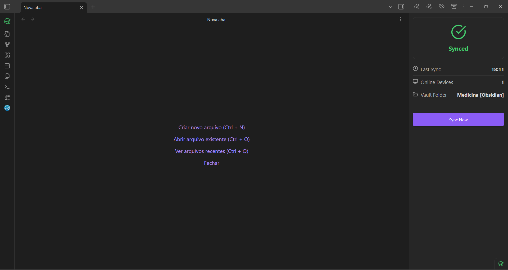
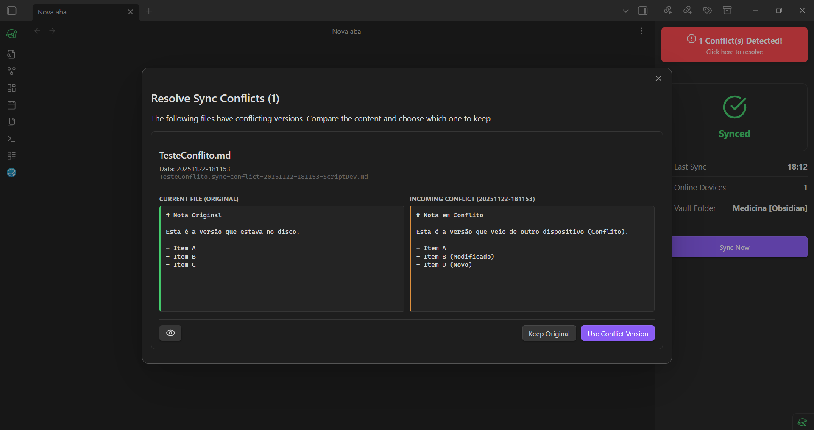
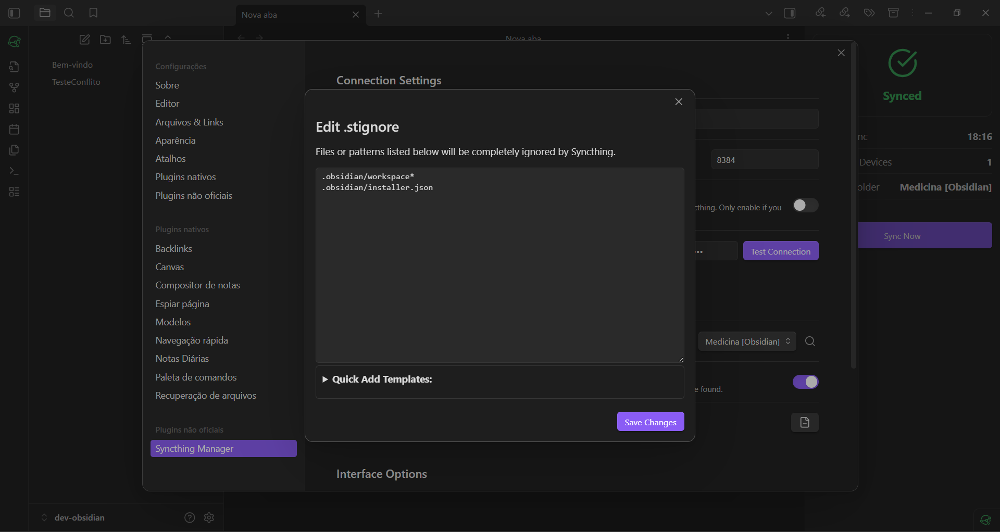

# Syncthing Manager for Obsidian

**Control, monitor, and manage your Syncthing synchronization directly from Obsidian.**

This plugin acts as a bridge to your local Syncthing API, providing real-time status updates, a powerful conflict resolver, and tools to keep your vault healthy across Desktop and Mobile devices.

## ✨ Key Features

* **🟢 Live Status Monitoring:** Know immediately if your vault is Synced, Syncing, or Disconnected via the Status Bar (Desktop) or Side Panel (Mobile).
* **⚔️ Conflict Resolver:** Automatically detects `.sync-conflict` files and provides a **side-by-side diff view** to compare content before deciding to keep the original or accept the conflict version.
* **🛡️ .stignore Editor:** Easily manage ignored files (like `workspace.json` layouts) using built-in templates to prevent glitches between Mobile and Desktop.
* **📱 Mobile Optimized:** Features a responsive **Side Panel View** designed specifically for Android workflows.
* **🌍 Multi-language:** Fully translated into **English** and **Portuguese (Português-BR)**.

## ⚙️ Configuration

### 1. Get your API Key
1.  Open Syncthing on your device.
2.  Go to **Actions** > **Settings** > **General**.
3.  Copy the **API Key**.

### 2. Setup in Obsidian
1.  Open Obsidian Settings > **Syncthing Manager**.
2.  Paste your **API Key**.
3.  Set the URL/Host (Default: `127.0.0.1`) and Port (Default: `8384`).
4.  Click **Test Connection**.
5.  **Important:** Select your **Vault Folder** from the dropdown menu to track specific events for this vault.

---

### 📱 Android Setup (Critical)

To use this plugin on Android (via *Syncthing-Fork* or the official app), you must configure Syncthing to allow local HTTP connections.

> [!WARNING]
> **HTTPS Restriction:** Obsidian Mobile cannot connect to self-signed HTTPS certificates on localhost. You **must disable HTTPS** for the GUI in the Syncthing App settings.

1.  Open the Syncthing App > **Settings** > **GUI**.
2.  Set **GUI Listen Address** to `127.0.0.1:8384` (This restricts access to your phone only, keeping it safe).
3.  **Disable** the "Use HTTPS for GUI" option.
    * *Note: If the app keeps re-enabling HTTPS, ensure you have cleared the "GUI Authentication User/Password" fields, as the app enforces HTTPS if a password is set.*
4.  Restart the Syncthing App.
5.  In the Obsidian Plugin Settings, ensure **Use HTTPS** is **OFF**.

---

## 📖 Features Guide

### ⚔️ Conflict Resolution
When a sync conflict occurs (e.g., edited the same note on two devices while offline), a red alert will appear in the Syncthing View.

1.  Click the alert to open the **Conflict Resolver**.
2.  Click **Compare Content** to see the differences side-by-side.
3.  Choose:
    * **Keep Original:** Deletes the conflict file.
    * **Use This Version:** Overwrites your current note with the conflict version.

### 🛡️ Ignoring Files (.stignore)
To prevent Obsidian layout settings from syncing and messing up your mobile workspace:

1.  Open **Settings** > **Syncthing Manager**.
2.  Click **Edit .stignore**.
3.  Use the "Add Common Patterns" buttons to quickly ignore workspace configs or installer caches.

---

## 📥 Installation

### Manual / BRAT (Beta)
1.  Install the **BRAT** plugin from the Community Store.
2.  Add this repository URL: `https://github.com/gustjose/obsidian-syncthing-manager`.
3.  Enable "Syncthing Manager".

---

## 🤝 Contributing

Feel free to open issues or PRs!

* **Build:** `npm run build`
* **Dev:** `npm run dev`

## License
MIT